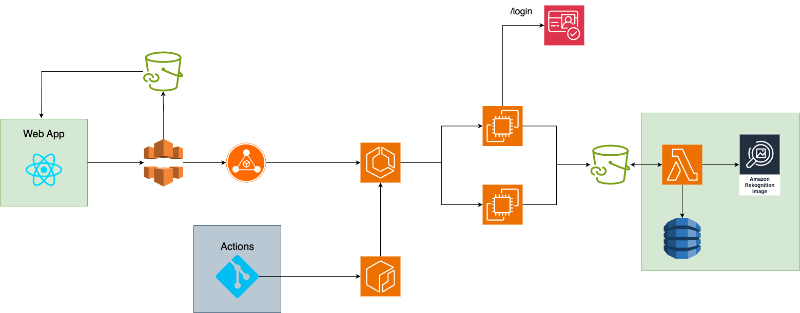
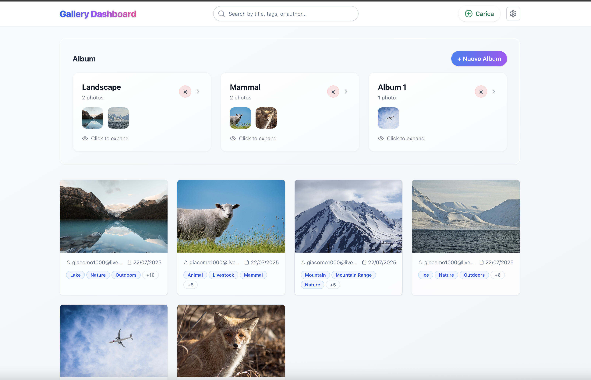
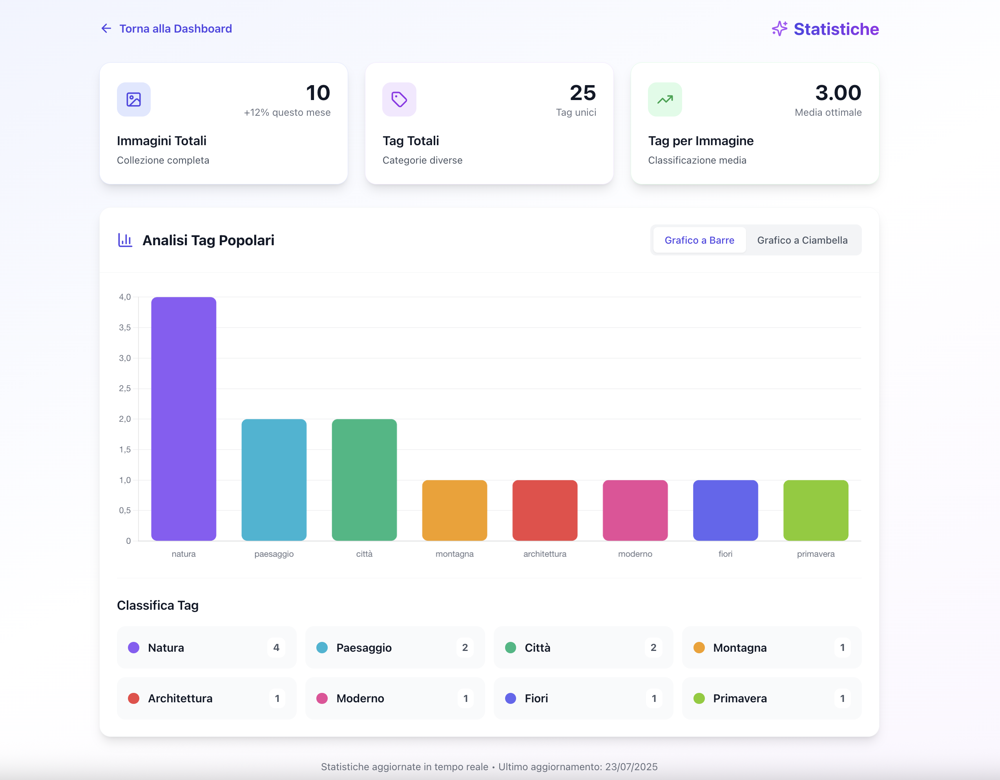

# CloudyGallery: Gestione di Immagini su AWS

CloudyGallery è una piattaforma cloud per la gestione intelligente di immagini. Il sistema
consente di caricare, organizzare, ricercare e analizzare immagini tramite una dashboard
web, integrando funzionalità come il riconoscimento automatico dei tag tramite Ama-
zon Rekognition, la gestione di album personalizzati e la visualizzazione di statistiche
interattive.
L’architettura si basa su un frontend React ospitato su S3, un backend FastAPI con-
tainerizzato e deployato su ECS, e una funzione Lambda per l’analisi automatica delle
immagini. L’infrastruttura è completamente automatizzata tramite Terraform e il ciclo
di vita applicativo `e gestito da pipeline CI/CD su GitHub Actions.

## Caratteristiche principali
- **Upload immagini multiplo** tramite drag&drop, con tag personalizzati e anteprima.
- **Dashboard** per visualizzare, filtrare e ricercare immagini e album.
- **Gestione album**: creazione, eliminazione, spostamento immagini tra album.
- **Tag automatici** tramite Amazon Rekognition e tag personalizzati.
- **Statistiche e grafici** sui tag e sulle immagini (Chart.js).
- **Autenticazione sicura** con Amazon Cognito (OAuth2).
- **Eliminazione immagini e album** con feedback visivo.
- **API RESTful** protette da JWT e credenziali temporanee Cognito.
- **Infrastruttura automatizzata** con Terraform.
- **Pipeline CI/CD** con GitHub Actions.

## Architettura
- **Frontend**: React, ospitato su S3 e distribuito tramite CloudFront.
- **Backend**: FastAPI containerizzato, deploy su ECS EC2.
- **Lambda**: Analisi automatica immagini e salvataggio tag su DynamoDB.
- **S3**: Storage immagini e hosting frontend.
- **DynamoDB**: Database NoSQL per tag e metadati immagini.
- **Rekognition**: Analisi immagini e generazione tag.
- **Cognito**: Autenticazione e gestione utenti.
- **Terraform**: Provisioning e gestione infrastruttura.
Di seguito lo schema architetturale del sistema:


*Figura 1: Architettura generale del sistema su AWS.*

## Come avviare il progetto

### Prerequisiti
- AWS CLI configurato
- Docker
- Node.js e npm
- Python 3.9+
- Terraform >= 1.3.0

### Setup infrastruttura
1. Configura le variabili d'ambiente in `frontend/.env` e `backend/.env`.
2. Esegui il deploy delle risorse AWS con Terraform:
   ```sh
   cd terraform
   terraform init
   terraform apply
   ```

### Avvio backend
1. Costruisci e avvia il backend:
   ```sh
   cd backend
   docker build -t cloudygallery-backend .
   docker run --env-file .env -p 8000:8000 cloudygallery-backend
   ```

### Avvio frontend
1. Installa le dipendenze e avvia il frontend:
   ```sh
   cd frontend
   npm install
   npm start
   ```

### Deploy in produzione
- Il deploy avviene tramite pipeline GitHub Actions che aggiorna ECS e S3.

## API principali
- `POST /upload`: Upload immagini su S3
- `GET /images/{user_id}`: Elenco immagini e album utente
- `DELETE /images/{user_id}/{filename}`: Elimina immagine
- `POST /images/move`: Sposta immagine tra album
- `GET /tags/{user_id}`: Elenco tag utente
- `GET /albums/{user_id}`: Elenco album
- `POST /albums`: Crea album
- `DELETE /albums/{album_name}/{user_id}`: Elimina album
- `POST /exchange-code`: Scambio codice OAuth2 per token Cognito


## Screenshot


*Figura 2: Esempio di dashboard utente.*


*Figura 3: Visualizzazione delle statistiche sui tag delle immagini.*


## Autori
- Messina Giacomo Giovanni

## Licenza
Questo progetto è distribuito con licenza MIT.
